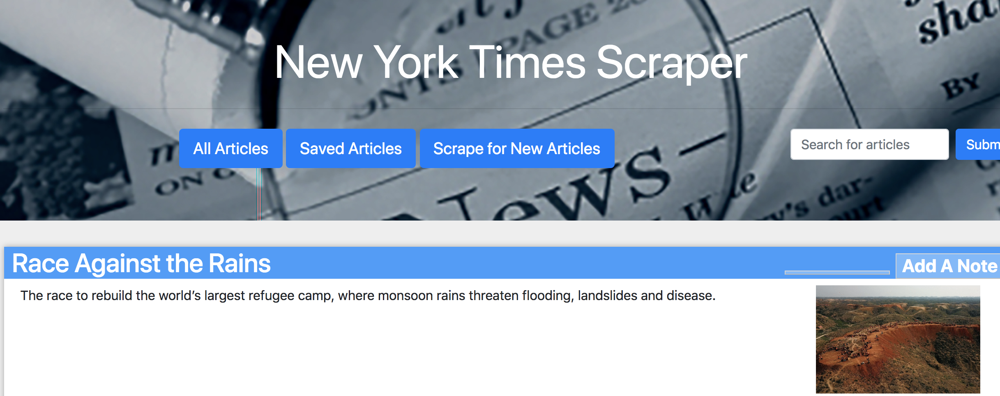

#NYTimes News Scraper

### Overview
The NYTimes News Scraper is an app that pulls the latest world news articles from the New York Times.  Users are able to save their favorite articles and add notes to their saved articles.  This app saves these notes and articles to a MongoDB and uses Mongoose to connect the DB to the app.

### App Screenshot

### Technologies Used
HTML, CSS, Bootstrap, JavaScript, Handlebars, MongoDB, ExpressJS